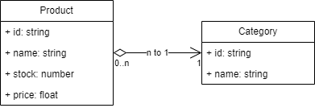

#  AgilStore
### Este projeto foi desenvolvido para conclusão do Desafio de Programação para o Processo Seletivo da Aceleradora Ágil 2025/1
##### O projeto consiste em uma aplicação para controle do inventário de produtos da loja AgilStore

## Projeto desenvolvido utilizando as seguintes tecnologias
  - NodeJS
  - Typescript
  - Fastify

## Diagrama de Classes


## Visualização do Projeto
Para visualizar o projeto localmente, siga as instruções abaixo.

1. Clone o repositório:
```bash
git clone https://github.com/matheusdsilva01/aceleradora.git
```

2. Acesse o diretório do projeto frontend e instale as dependências: 

```bash
cd aceleradora
cd backend
npm install
```

4. Após a instalação das dependências, execute o projeto:

```bash
npm run dev
```

## Coleção para Postman da API
Você pode importar a coleção da API no Postman importando o arquivo `AgilStore.postman_collection.json` que está na raiz do projeto. [Clique aqui para visualizar o arquivo](./AgilStore.postman_collection.json)\
A coleção contém as rotas da API com exemplos de requisições.


## Scripts Disponíveis

No diretório do projeto, você pode executar:

### `npm install`

Para instalação de todas as dependências necessárias para funcionamento do projeto.

### `npm run dev`

Executa o aplicativo:\
Abra [http://localhost:8080](http://localhost:8080) para visualizá-lo no navegador.\
A página será recarregada se você fizer edições no código.